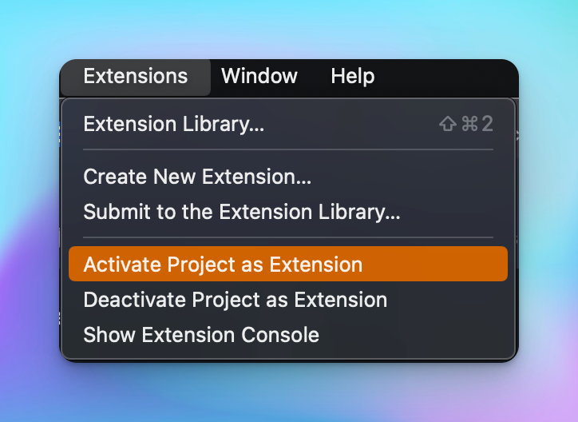

<!--
👋 Hello! As Nova users browse the extensions library, a good README can help them understand what your extension does, how it works, and what setup or configuration it may require.

Not every extension will need every item described below. Use your best judgement when deciding which parts to keep to provide the best experience for your new users.

💡 Quick Tip! As you edit this README template, you can preview your changes by selecting **Extensions → Activate Project as Extension**, opening the Extension Library, and selecting "Vale Linter" in the sidebar.

Let's get started!
-->

<!--
🎈 Include a brief description of the features your extension provides. For example:
-->

**Vale Linter** automatically lints all files as configured by '.vale.ini', then reports errors and warnings in Nova's **Issues** sidebar and the editor gutter:

<!--
🎈 It can also be helpful to include a screenshot or GIF showing your extension in action:
-->

## Requirements

<!--
🎈 If your extension depends on external processes or tools that users will need to have, it's helpful to list those and provide links to their installers:
-->

Vale Linter requires some additional tools to be installed on your Mac:

- [Vale](https://vale.sh)

<!--
✨ Providing tips, tricks, or other guides for installing or configuring external dependencies can go a long way toward helping your users have a good setup experience:
-->

## Getting started

Clone the repository and activate the project for development.

